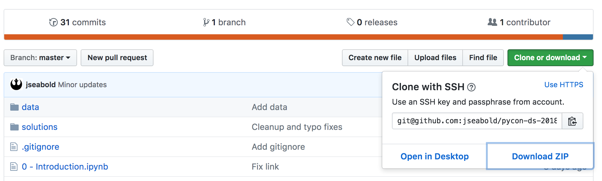
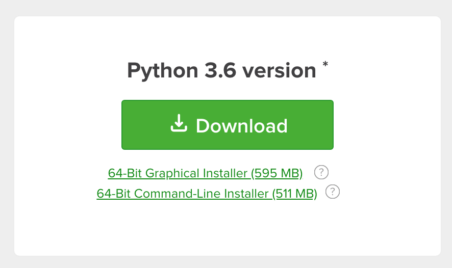

# Introduction to Python for Data Science

This is the Pycon 2018 tutorial Introduction to Python for Data Science.

## Outcomes

Attendees will come away with knowledge about how to effectively use Python and packages in the PyData stack like pandas, matplotlib, and scikit-learn to do data science. We'll learn how to get and read data, clean and munge data, conduct exploratory data analysis, and use scikit-learn to do machine learning with a real-world data set. We will focus on best practices in using Python along the way.

## Pre-Requisites

Some very basic knowledge of Python will be helpful. If you have never used Python before, but have programmed in some other language, that's fine. If you don't have a lot of experience with programming, you may want to look at at least the first five sections of the [python tutorial](https://docs.python.org/3/tutorial/). Other than the basics of Python, no familiarity with Python tools will be expected.

Some knowledge of statistics and data science will be helpful.

## Requirements

### Download the Tutorial

If you would like to code along during the workshop, follow these steps.

*If you are familiar with git*, clone this repository. To do so at the command line, type

```bash
git clone git@github.com:jseabold/pycon-ds-2018
```

*If you are not familiar with git*, you can download the code directly from GitHub.



The day before the conference, you will want to check for any code changes. From the directory that contains the code, run

```
git pull
```

Or, download the zip file again.

### Install the Packages

Before you arrive, install all of the pre-requisite packages. **You may not be able to rely on conference Wi-Fi to do this**.

*If you don't have conda or anaconda installed*, you may want to download the Python Anaconda Distribution. Go to [anaconda.org](https://anaconda.org) and click on Download Anaconda.


Select the Python 3.X version for your OS (it should be automatically chosen). Download and install anaconda.



Now that you have conda or anaconda, type the following from *the directory with this code* at the terminal or command prompt.

```bash
conda env create -f environment.yaml
```

### Activate the Environment with the Packages

Now you need to switch to the environment we just created with the packages installed. If you are on macOS or linux, run in the terminal

```bash
source activate pycon-ds-2018
```

If you are on windows, run at the command prompt

```bash
activate pycon-ds-2018
```

Make sure you can run the Jupyter Notebooks

```bash
jupyter notebook
```

You can make sure that all of the packages were installed correctly, by running the following at a new or different terminal or command prompt (i.e., not the one you just typed `jupyter notebook` in) within the same directory with the code.

```bash
python imports-test.py
```

### Data

Go ahead and unzip the data in the `data/` directory. Depending on how you unzip the archive *this may create a subdirectory, if it does then you need to move all of the files into the parent directory*. All of the data files should be in the `data/` directory *not* `data/data`.


## Outline

### Introduction

What's data science? Why Python? What does it mean to write Pythonic code?

### Geting and Reading Data with Python

Working with CSVs, json, web data using pure Python and pandas.

### Data Wrangling with Pandas

How can I use pandas to clean my data?

### Exploratory Analysis with Pandas

How can I use pandas to learn more about data?

### Exploratory Plotting

How can I use Python plotting libraries like matplotlib and seaborn to understand the structure in my data?

### Scikit-Learn

How can I put all of this together and build a machine-learning pipeline on some real world data?
